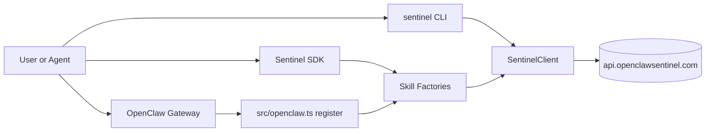
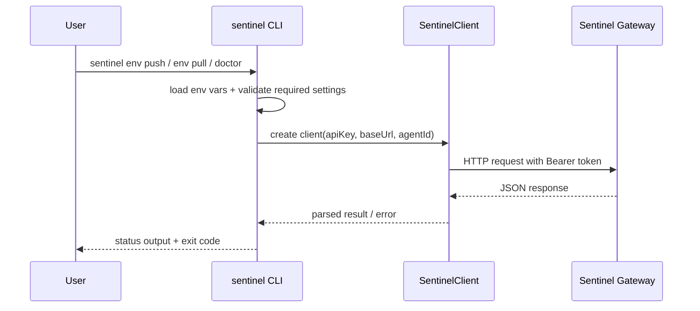
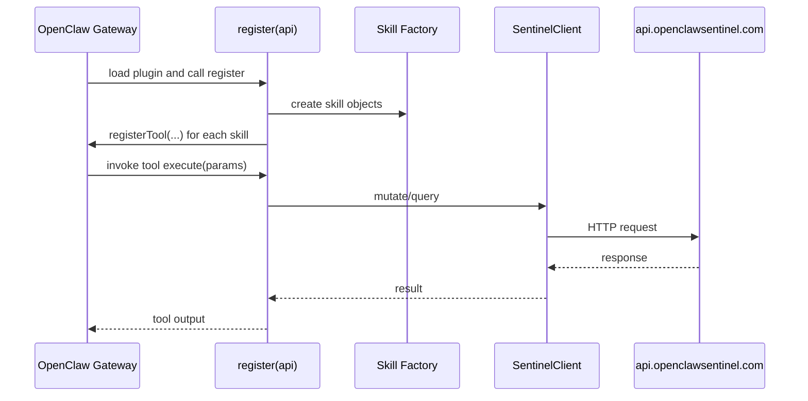

# STRUCTURE.md

This document explains how `sentinel-sdk` is structured, how data flows through it, and which commands exist.

## High-level architecture



## Repository layout

```text
sentinel-sdk/
├── package.json               # npm metadata, bin entry, OpenClaw addon fields
├── tsconfig.json              # TypeScript build settings
├── openclaw.plugin.json       # OpenClaw plugin manifest + config schema
├── SKILL.md                   # OpenClaw skill instructions/frontmatter
├── README.md                  # User and maintainer guide
├── STRUCTURE.md               # This file
└── src/
    ├── index.ts               # SDK entry: Sentinel class and default skill wiring
    ├── client.ts              # API transport wrapper + path map + timeout logic
    ├── openclaw.ts            # OpenClaw plugin register() and tool registration
    ├── bin/
    │   └── sentinel.ts        # CLI command definitions
    └── skills/
        ├── remoteMemory.ts    # save_remote_memory factory
        ├── backupBrain.ts     # backup_brain factory
        └── sentinelHeartbeat.ts # sentinel_heartbeat factory
```

## Runtime modules and responsibilities

- `src/client.ts`
  - Central request layer.
  - Maps internal operation keys to HTTP endpoints.
  - Applies request timeout (`AbortController`, 10s).

- `src/skills/*.ts`
  - Each file exports a factory that returns a tool-like object:
    - `name`
    - `description`
    - `parameters` (zod schema)
    - `execute(args)`

- `src/index.ts`
  - SDK-level composition for non-OpenClaw consumers.
  - Creates `SentinelClient` from env/config and exposes `skills` array.

- `src/openclaw.ts`
  - Plugin entrypoint for OpenClaw (`register(api)`).
  - Reads plugin/env config.
  - Registers tools into Gateway slot.
  - Supplies input JSON schemas and tool annotations.
  - Returns actionable setup messages when apiKey is missing.

- `src/bin/sentinel.ts`
  - Commander CLI front-end.
  - Includes doctor, canonical env subcommands with deprecated aliases, and heartbeat installer.

## Data flow details

### 1) CLI flow (`env push`, `env pull`, `doctor`)



### 2) OpenClaw plugin flow



## API operation mapping

Internal key -> endpoint mapping in `src/client.ts`:

- `health:get` -> `GET /v1/health`
- `memories:create` (legacy alias: `memories:saveThought`) -> `POST /v1/memories`
- `memories:search` -> `GET /v1/memories/search`
- `backups:create` (legacy alias: `backups:createSnapshot`) -> `POST /v1/backups`
- `backups:list` -> `GET /v1/backups`
- `audit_logs:ingest` -> `POST /v1/audit-logs`

In this release, gateway secrets routes are intentionally deferred. `secrets:*` operations return actionable guidance.

## Complete command inventory

### npm/package commands

- `npm install`
- `npm run build`
- `npm run prepublishOnly`

### sentinel CLI commands

- `sentinel --help`
- `sentinel doctor`
- `sentinel doctor --json`
- `sentinel doctor --strict-warn`
- `sentinel env push`
- `sentinel env pull`
- `sentinel env-push` `[deprecated alias]`
- `sentinel env-pull` `[deprecated alias]`
- `sentinel install-heartbeat`

### Common OpenClaw integration commands (development)

- `openclaw plugins install . --link`
- `openclaw plugins info sentinel-sdk`
- `openclaw plugins doctor`
- `openclaw skills check`
- `openclaw doctor --yes`

## Configuration surfaces

### SDK constructor (`src/index.ts`)

- `apiKey?: string`
- `baseUrl?: string`
- `agentId?: string`

### Plugin config schema (`openclaw.plugin.json`)

- `apiKey?: string`
- `baseUrl?: string`
- `agentId?: string`
- `additionalProperties: false`

### Environment fallback rules

Priority generally follows explicit config -> env var -> default:

- `apiKey`: config `apiKey` -> `SENTINEL_API_KEY` -> none (error or setup message)
- `baseUrl`: config `baseUrl` -> `SENTINEL_API_BASE_URL` -> `https://api.openclawsentinel.com`
- `agentId`: config `agentId` -> `AGENT_ID` -> `default-agent`

## Current behavior guarantees

- `doctor` exits non-zero on FAIL checks.
- `doctor --strict-warn` exits non-zero on WARN or FAIL checks.
- `install-heartbeat` is idempotent.
- API requests time out after 10 seconds.

## Known limitations and handoff notes

- Operation map in `src/client.ts` is strict and rejects unknown operation keys.
- Secrets sync over gateway HTTP is intentionally deferred in this release.
- Legacy aliases `env-push` and `env-pull` are temporary and will be removed in a later release.
- Error text in plugin wrappers is user-friendly but can be expanded with error codes if backend standardizes them.

Recommended next steps for next agent:

1. Add integration tests with mocked API responses for CLI and plugin execution paths.
2. Add optional `.env` merge strategy for `env-pull` (append, overwrite, or interactive mode).
3. Add `--json` support for `env-push`/`env-pull` for automation symmetry.
